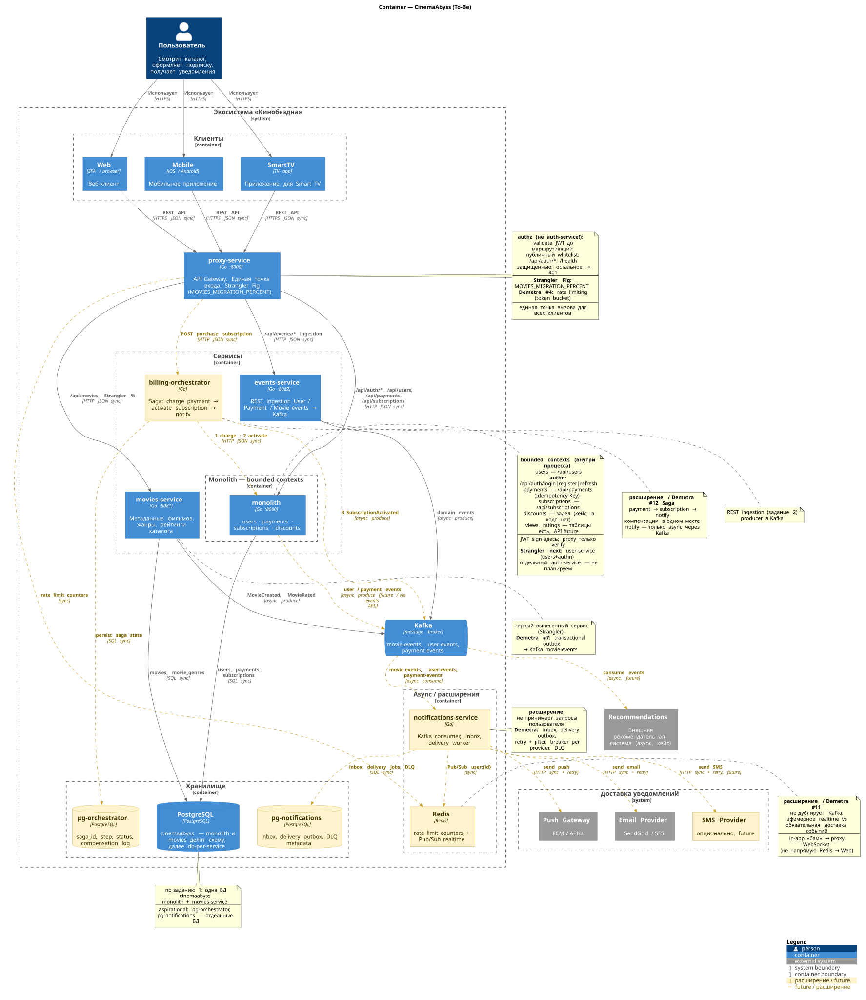

# Архитектура микросервисов CinemaAbyss

## Задание 1. Проектирование архитектуры (To-Be)

Домены As-Is → To-Be, интеграция и единая точка входа — в [docs/domains-as-is-to-be.md](docs/domains-as-is-to-be.md).

| Домен | To-Be контейнер |
| --- | --- |
| Пользователи, authn | **monolith** (bounded context users) |
| Метаданные фильмов | **movies-service** |
| Платежи, подписки, скидки | **monolith** (bounded contexts) |
| Domain events | **events-service** + **Kafka** |
| Рекомендации | **System_Ext** (внешняя система) |

**Единая точка входа:** `proxy-service` (:8000) — web / mobile / Smart TV → API Gateway → monolith / movies / events.



Исходник: [docs/c4/02-container-to-be.puml](docs/c4/02-container-to-be.puml) · As-Is Context: [docs/c4/01-context-as-is.puml](docs/c4/01-context-as-is.puml)

---

## Обзор.
 В проекте реализована следующая функциональность:

- Извлечение микросервисов с использованием паттерна Strangler Fig
- Развертывание в Kubernetes для оркестрации и масштабирования
- API Gateway для унифицированного доступа к сервисам
- Архитектура, управляемая событиями, с использованием Kafka
- CI/CD Pipeline с GitHub Actions

## Компоненты

### Монолит
Исходное монолитное приложение обрабатывает:

- Управление пользователями
- Метаданные фильмов
- Платежи
- Подписки

Сервис расположен в src/monolith/.

### Микросервисы

#### Movies Service
Извлечен из монолита, обрабатывает всю функциональность, связанную с фильмами:

- Метаданные фильмов
- Рейтинги
- Жанры

Расположен в src/microservices/movies/.

#### Events Service
Обрабатывает коммуникацию между сервисами на основе событий с использованием Kafka:

- События фильмов (просмотр, оценка, добавление)
- События пользователей (регистрация, вход)
- События платежей (успешные, неудачные)

Расположен в src/microservices/events/.

#### Proxy Service (API Gateway)
Реализует функционал для постепенного перехода от монолита к микросервисам:

- Маршрутизация запросов между монолитом и микросервисами
- Поддержка постепенного перехода с процентной маршрутизацией
- Действует как фасад для всей системы

Расположен в src/microservices/proxy/.

## Инфраструктура

### Kubernetes
Манифесты Kubernetes для развертывания всех компонентов расположены в src/kubernetes/.

### Helm Charts
Charts Helm для упрощения развертывания и управления:

Расположены в src/kubernetes/helm/cinemaabyss/.

### Kafka
Расположено в src/kubernetes/kafka/.

### CI/CD Pipeline
GitHub Actions для непрерывной интеграции и развертывания:

- Сборка и тестирование микросервисов
- Сборка и выгрузка Docker-образов
- Сборка C4-схем: `docs/**/*.puml` → SVG рядом, коммит в git ([`.github/workflows/plantuml.yml`](.github/workflows/plantuml.yml))

Расположены в .github/workflows/.

Исходники схем — `docs/c4/*.puml`. Картинку собирает Actions и кладёт рядом: `docs/c4/*.svg`.


## Детали реализации

#### Паттерн Strangler Fig

Реализован через proxy-сервис, который выступает в роли фасада перед монолитом и микросервисами. Он маршрутизирует трафик на основе конфигурации:

- При включенном фиче-флаге маршрутизирует определенный процент трафика в микросервис
- При отключенном маршрутизирует весь трафик для определенного домена в соответствующий микросервис

Это позволяет осуществлять контролируемый постепенный переход без нарушения работы пользователей.

## Локальная разработка (Make)

Из корня репозитория.

### Требования

- **Docker** и **Docker Compose** — для `make up` / `make down`
- **Go 1.23+** — для `make build` и `make run`
- **Node.js 18+** и **npm** — для `make test-api` (Newman)

### Быстрый старт

Полный цикл проверки (lint → build → compose → Postman → остановка):

```bash
make lint-microservices
make build-microservices
make up
make test-api
make down
```

После `make up` сервисы доступны:

| Сервис | URL |
| --- | --- |
| API Gateway (proxy) | http://localhost:8000 |
| Monolith | http://localhost:8080 |
| Movies Service | http://localhost:8081 |
| Events Service | http://localhost:8082 |
| Kafka UI | http://localhost:8090 |

### Команды

| Команда | Описание |
| --- | --- |
| `make help` | список команд |
| `make lint proxy` / `make lint events` | golangci-lint в Docker (v2.6.2) |
| `make build proxy` / `make build events` | сборка бинарника в `bin/` |
| `make run <service>` | локальный запуск с env из compose (`proxy`, `events`, `movies`, `monolith`) |
| `make lint-microservices` / `make build-microservices` | proxy + events разом |
| `make up` / `make down` | `docker compose up -d --build` / `down` |
| `make test-api` | Postman-тесты (`tests/postman`, local env) |

### Локальный run (без пересборки compose)

Когда меняете только Go-код одного сервиса, поднимите инфраструктуру через compose, а сервис — в отдельном терминале:

```bash
# терминал 1 — postgres, kafka и остальные контейнеры
make up

# терминалы 2–5 — только нужные сервисы (остальные остаются в Docker)
make run monolith
make run movies
make run events
make run proxy
```

`make run` подставляет те же переменные окружения, что и `docker-compose.yml` (порты, URL backend'ов, `MOVIES_MIGRATION_PERCENT`).

### Проверка Strangler Fig

1. Измените `MOVIES_MIGRATION_PERCENT` в [`docker-compose.yml`](docker-compose.yml) (например, `"0"` — всё в monolith, `"100"` — всё в movies-service).
2. Перезапустите стек: `make down && make up`
3. Отправьте запросы через gateway и смотрите логи proxy:

```bash
curl http://localhost:8000/api/movies
curl http://localhost:8000/api/movies/1
docker logs cinemaabyss-proxy-service
```

В логах proxy видно, какой backend выбран (`monolith` / `movies-service`) для каждого запроса.

### Примеры curl (через gateway)

```bash
# health
curl http://localhost:8000/api/health
curl http://localhost:8000/api/movies/health
curl http://localhost:8000/api/events/health

# monolith через proxy
curl http://localhost:8000/api/users
curl http://localhost:8000/api/movies

# events (Part 2)
curl -X POST http://localhost:8000/api/events/movie \
  -H 'Content-Type: application/json' \
  -d '{"movie_id":1,"title":"Test","action":"view","user_id":1}'
```

### Скриншоты и описание решения

Скриншоты проверки задания 2: [docs/screenshots/assignment-2/](docs/screenshots/assignment-2/) (Part 1 — Postman summary и proxy; Part 2 — после Kafka).

Описание решения: [Project_template.md](Project_template.md#решение)

## Deployment Instructions

### Local Development with Docker Compose

Требования и быстрый старт через Make — в секции [Локальная разработка (Make)](#локальная-разработка-make). Кратко:

```bash
make up    # docker compose up -d --build
make down  # docker compose down
```

Альтернатива без Make: `docker compose up -d --build` / `docker compose down`.

Порты сервисов — в таблице выше. Для пересборки после изменений: `make down && make up`.

### Kubernetes Deployment

#### Требования

- Kubernetes cluster (v1.19+)
- Helm (v3.2.0+)
- kubectl

#### Развертывание

1. Создайте namespace:
```bash
kubectl apply -f src/kubernetes/namespace.yaml
```
2. Разверните Kafka:
```bash
kubectl apply -f src/kubernetes/kafka/kafka.yaml
```
3. Разверните базу данных:
```bash
kubectl apply -f src/kubernetes/postgres.yaml
```
4. Разверните монолит:
```bash
kubectl apply -f src/kubernetes/monolith.yaml
```
5.Разверните микросервисы:
```bash
kubectl apply -f src/kubernetes/movies-service.yaml
kubectl apply -f src/kubernetes/events-service.yaml
```
6. Разверните прокси-сервис:
```bash
kubectl apply -f src/kubernetes/proxy-service.yaml
```

### Развертывание через CI/CD
Проект включает GitHub Actions для CI/CD:

- Сборка и тестирование: Автоматически собирает и тестирует код при пуше или пул-реквесте.
- Сборка Docker и выгрузка: Создает Docker-образы и выгружает их в GitHub Container Registry.

Чтобы использовать пайплайн CI/CD:

1. Создайте форк или клонируйте этот репозиторий в свой аккаунт GitHub.
2. Отправьте изменения в основную ветку для запуска пайплайна CI/CD.
3. Выполните ручное или автоматическое развертывание (Helm) в локальной среде

## Тестирование API с Postman
Проект включает комплексный набор тестов Postman, которые можно запускать из командной строки с помощью Newman. 

Тесты проверяют базовую функциональность всех сервисов в архитектуре.

Покрытие тестами
-  сервис: Пользователи, Фильмы, Платежи, Подписки
- Микросервис фильмов: Проверка работоспособности, Операции с фильмами
- Микросервис событий: Проверка работоспособности, Публикация событий
- Прокси-сервис: Проверка работоспособности, Проксирование запросов

### Запуск тестов

#### Предварительные требования

- Node.js (v14 или выше)
- npm (v6 или выше)
- Newman (установлен через npm)

#### Установка
1. Перейдите в директорию тестов
```bash
cd tests/postman
```
2. Установите зависимости
```bash
npm install
```
3. Запуск тестов локально
```bash
npm run test:local
```
или
```bash
npm run test:docker
```
4. Запуск тестов с помощью shell-скрипта
1. Сделайте скрипт исполняемым
chmod +x run-tests.sh

2. Запустите все тесты
```bash
./run-tests.sh -e local
```
или
```bash
./run-tests.sh -d -e docker
```

### Тестирование деплоя руками

Примеры `curl`, проверка Strangler Fig и Kafka UI — в секции [Локальная разработка (Make)](#локальная-разработка-make).