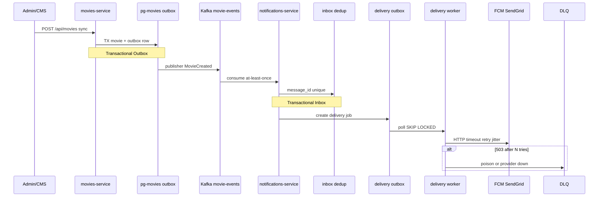

# ADR-002: Sync HTTP + Event-Driven Kafka; Demetra Outbox / Inbox / DLQ

- Status: Accepted
- Date: 2026-09-19
- Deciders: команда разработки CinemaAbyss

## Context

As-Is ([ADR-001](0001-as-is-monolith.md)) — синхронный REST → SQL в одном процессе. To-Be ([`docs/domains-as-is-to-be.md`](../domains-as-is-to-be.md), [`02-container-to-be.puml`](../c4/02-container-to-be.puml)) добавляет несколько deployable-сервисов, **Kafka** как шину доменных событий и **notifications-service** как async-реакцию на события.

Нужно зафиксировать:

1. **Когда sync, когда async** — чтобы пользовательский запрос не блокировался на push/email и рекомендациях.
2. **Как не терять события** между COMMIT в Postgres и publish в Kafka (Transactional Outbox).
3. **Как пережить at-least-once** в Kafka и падение внешних провайдеров (Inbox, delivery outbox, retry, DLQ).

Опора по паттернам: [Demetra — паттерны бэкенда, часть 1](https://platform.demetra.site/blog/microservice-patterns). На Container и в ADR подписываем только уместные паттерны; не все 12 из статьи.

**Kafka-топики** (из `docker-compose.yml`): `movie-events`, `user-events`, `payment-events`.

| Топик | Событие | Кто публикует | Кто потребляет |
| --- | --- | --- | --- |
| `movie-events` | `MovieCreated`, `MovieRated` | movies-service, events API | notifications, рекомендации (future) |
| `user-events` | `UserRegistered` | monolith / events API | notifications (welcome), analytics |
| `payment-events` | `PaymentCompleted` | monolith / events API | notifications (чек), billing |

**events-service** — REST ingestion `/api/events/*` (задание 2) + producer в Kafka. **notifications-service** — отдельный consumer; на схеме задания 1 рисуем полный контур, код — после задания 2.

## Decision

### 1. Два слоя интеграции: sync HTTP и async Kafka

| Тип | Когда | Как | Примеры |
| --- | --- | --- | --- |
| **Sync** | пользователь ждёт ответ сейчас | клиент → proxy → сервис → SQL → ответ | login, каталог, CRUD users, charge payment |
| **Async** | побочный эффект, другой домен, рассылка | сервис → Kafka → consumer(s) | `MovieCreated` → push; `SubscriptionActivated` → welcome |

HTTP — **запросы**. Kafka — **реакции**. Команда пользователя в брокер не идёт: нужен ответ в том же HTTP-запросе.

Клиенты ходят только в **proxy-service** (`:8000`). Sync-маршруты: monolith, movies-service, events-service, billing-orchestrator.

### 2. Три слоя async в notifications (Demetra)

| Слой | Паттерны | Технология |
| --- | --- | --- |
| **1. Доменное событие** | Event-Driven Messaging (#6) + **Transactional Outbox** (#7) | movies-service → outbox в Postgres → publisher → Kafka `movie-events` |
| **2. Обработка события** | **Transactional Inbox** (#8) + идемпотентный job | notifications + `pg-notifications`: `inbox_messages(message_id)` |
| **3. Доставка наружу** | Outbox jobs + **Retry/backoff/jitter** (#3) + **External API** (#5) + **Circuit Breaker** (#1) + **DLQ** (#10) | worker poll `FOR UPDATE SKIP LOCKED` → FCM / Email / SMS |

**Transactional Outbox (movies-service):** в одной TX с `INSERT movie` — строка в таблице `outbox`. Отдельный publisher читает outbox и публикует в Kafka. Между COMMIT и Kafka событие не теряется.

**Transactional Inbox (notifications-service):** consumer Kafka перед обработкой пишет `message_id` в inbox. At-least-once от rebalance → дубль отбит unique constraint; второй push не уйдёт.

**Outbox доставки (notifications-service):** consumer **не** шлёт в FCM/Email напрямую. Создаёт **delivery job** в outbox (`pg-notifications`); worker забирает job, вызывает провайдера с timeout, retry только на `5xx`/timeout, exponential backoff + jitter.

**DLQ:** после N неудачных попыток job попадает в `delivery-dlq` (таблица или топик с metadata). Ядовитое сообщение не блокирует всю партицию. Отдельный «DLQ-сервис» и второй Kafka-кластер на MVP **не** рисуем.

**Circuit Breaker:** отдельный breaker на каждого провайдера (FCM отдельно от Email). Пуш лёг — SMS/fallback или пауза, воркеры не съедаются.

### 3. Сценарий «вышел новый фильм» (reference flow)

1. Admin → movies-service: `POST /api/movies` (sync).
2. movies-service → Postgres: TX `movie` + outbox row (**Transactional Outbox**).
3. Publisher → Kafka `movie-events`: `MovieCreated`.
4. notifications-service consume (at-least-once) → **Inbox** (`message_id`).
5. Создан delivery job в outbox доставки.
6. Worker → FCM / SendGrid: HTTP + retry + jitter; breaker per provider.
7. После N retry → **DLQ**.

notifications-service **не** принимает запросы пользователя напрямую; подписан на топики Kafka. Настройки канала — позже через monolith API.

### 4. Паттерны Demetra → CinemaAbyss

На Container и в коде подписываем только уместные паттерны из [статьи Demetra](https://platform.demetra.site/blog/microservice-patterns).

| # | Паттерн Demetra | Где в «Кинобездне» | Зачем |
| --- | --- | --- | --- |
| 6 | Event-Driven Messaging | movies / monolith / events → **Kafka** | «Вышел фильм» — факт, не команда; потребители подключаются без правок продюсера |
| 7 | Transactional Outbox | **movies-service**: `INSERT movie` + outbox в одной TX | Не потерять событие между COMMIT и Kafka |
| 8 | Transactional Inbox | **notifications-service**: `inbox_messages(message_id)` | At-least-once → дубли от rebalance; второй push не уйдёт |
| 7 (2-й слой) | Outbox доставки | notifications + `pg-notifications`: job «отправить push» | Буфер между сервисом и FCM/Email |
| 3 | Retry + backoff + jitter | worker доставки → FCM / SendGrid | Провайдер лёг — не теряем, не DDoS-им при подъёме |
| 10 | Dead Letter Queue | `delivery-dlq` после N retry | Ядовитое сообщение не блокирует всю партицию |
| 5 | Работа с внешним API | notifications → Push / Email / SMS | Таймаут + retry + breaker + отдельный пул на провайдера |
| 1 | Circuit Breaker | notifications (FCM отдельно от Email) | Пуш лёг — SMS/fallback или пауза, воркеры не съедаются |
| 9 | Idempotency-Key | monolith `POST /api/payments` (sync) | Клиент повторил POST — одно списание |
| 4 | Rate limiting | **proxy** (token bucket по userId / API key) | Защита от всплесков, до базы не доходит лишнее |
| 11 | Pub/Sub Redis | **proxy** (счётчики) + realtime WebSocket «бам» | **Не дублирует Kafka**: Redis = эфемерное «сейчас на экране» |
| 12 | Saga (оркестрация) | **billing-orchestrator** + `pg-orchestrator` | payment → subscription → notify; state + компенсации в одном месте |
| — | Strangler Fig (курс) | proxy + `MOVIES_MIGRATION_PERCENT` | Не Demetra, но обязателен по заданию 2 |

**Redis ≠ Kafka:** Redis — rate limit и Pub/Sub для in-app колокольчика (можно потерять, при открытии app подтянет из Postgres). Kafka — событие обязано дойти (outbox, DLQ, domain events).

**Saga и notifications:** уведомление **не** в sync-цепочке orchestrator. После успешной активации подписки orchestrator публикует `SubscriptionActivated` в Kafka; notifications реагирует async.

### 5. Что рисуем на Container, что снаружи

**Внутри CinemaAbyss:**

- movies-service + note «transactional outbox → Kafka»;
- notifications-service + `pg-notifications` (inbox, delivery outbox, DLQ metadata);
- Kafka — domain events;
- events-service — ingestion + produce;
- monolith — future publish user/payment (или через events API).

**System_Ext (доставка):** Push (FCM/APNs), Email (SendGrid/SES), SMS (future note). Recommendations — async consumer (future), не блокирует HTTP.

Отдельный box на каждый топик или паттерн **не** делаем — достаточно notes на контейнерах.

## Alternatives considered

- **Всё sync через HTTP между сервисами** — notifications и рекомендации блокируют API; каскадные таймауты при падении FCM; не масштабируется на рассылку «новый фильм».
- **Publish в Kafka сразу после SQL без Outbox** — race: COMMIT прошёл, publish упал → событие потеряно навсегда.
- **Consumer шлёт push напрямую из Kafka handler** — провайдер лёг → consumer lag растёт, rebalance, дубли; нет retry/DLQ per job.
- **Второй Kafka-кластер для delivery queue** — избыточно на MVP; outbox в Postgres notifications-service проще для ревьюера и отладки.
- **Хореография Saga через Kafka вместо orchestrator** — сценарий размазан по consumer'ам, сложнее отладка и компенсации; orchestrator — primary (см. Container note).
- **Redis Pub/Sub вместо Kafka для domain events** — нет persistence и DLQ; подходит только для realtime UI, не для «событие обязано дойти».
- **Отдельный ADR на каждый топик** — шум; broker + notifications + Demetra-цепочка — одно решение (этот ADR).

## Consequences

- **Positive:** чёткое разделение sync/async; пользовательский путь не зависит от FCM/Email; outbox/inbox/DLQ закрывают типичные failure modes Kafka и внешних API; паттерны явно подписаны на Container для ревьюера.
- **Negative:** больше инфраструктуры (Kafka, pg-notifications, workers, Redis); at-least-once требует inbox и идемпотентности; реализация — задание 2+ (events MVP), notifications — расширение после proxy/events.
- **Follow-up:** задание 2 — proxy, events-service, Kafka producer/consumer MVP; затем notifications-service с inbox/delivery outbox; ADR-003 — auth (JWT monolith, authz proxy); ADR-004 — Strangler Fig.

## References

- [Demetra — паттерны бэкенда, часть 1](https://platform.demetra.site/blog/microservice-patterns)
- [`docs/domains-as-is-to-be.md`](../domains-as-is-to-be.md) — таблицы доменов и Demetra-закладка
- [`docs/c4/02-container-to-be.puml`](../c4/02-container-to-be.puml) — Container To-Be
