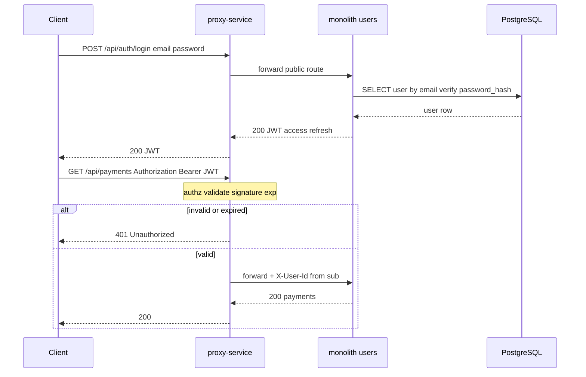

# ADR-003: Auth — JWT в monolith (users), проверка token на proxy

- Status: Accepted
- Date: 2026-09-19
- Deciders: команда разработки CinemaAbyss

## Context

As-Is ([ADR-001](0001-as-is-monolith.md)): аутентификации в коде нет — `/api/users` открыт, `password_hash` в таблице `users` есть, но login/register API нет. В кейсе пользователь логинится; без auth To-Be не соответствует продуктовой модели.

To-Be ([`docs/domains-as-is-to-be.md`](../domains-as-is-to-be.md), [`02-container-to-be.puml`](../c4/02-container-to-be.puml)): несколько deployable-сервисов за **proxy-service** — единой точкой входа. Клиенты (web, mobile, smart TV) ходят только в proxy; дальше запрос маршрутизируется в monolith, movies-service, events-service или billing-orchestrator.

Нужно зафиксировать:

1. **Где выдаётся token** (аутентификация — кто ты).
2. **Где проверяется token** (авторизация на периметре — можно ли идти дальше).
3. **Где хранятся учётные данные** (users, `password_hash`).

Опора по разделению ролей: как в «Тёплом доме» (ADR-007) — **личность в users**, **проверка на Gateway**.

## Почему отдельный auth-service не рисуем на MVP

Container-диаграмма показывает **deployable**-сервисы (отдельный процесс / деплой). Auth на MVP — **не отдельный микросервис**, а **распределённая ответственность** между уже существующими контейнерами:

| Часть auth | Где на схеме (box) | Почему здесь, а не auth-service |
| --- | --- | --- |
| login, register, refresh | **monolith** (note «authn») | bounded context **users** уже в monolith; `password_hash` в той же БД `users` |
| validate JWT, 401, whitelist | **proxy-service** (note «authz») | единая точка входа; Gateway проверяет token **до** маршрутизации |
| хранение учёток | **monolith → PostgreSQL** | данные users не выносили; отдельный auth без своей БД = лишний hop |
| доверие downstream | **movies / events / orchestrator** | читают `X-User-Id` от proxy; пароль не знают |

**Отдельный auth-service** (Keycloak, custom OAuth) имеет смысл, когда: несколько несвязанных приложений, SSO, federation, отдельная команда IdP. В «Кинобездне» на этапе Strangler один продукт, users ещё в monolith — **второй deployable только для login** добавляет сеть, secret management и синхронизацию users без выигрыша.

**Чтобы было видно всё:** на Container auth **не прячем** — подписываем notes на proxy и monolith, маршрут `/api/auth/*` на связи proxy → monolith, таблицу ролей — в этом ADR и в [`domains-as-is-to-be.md`](../domains-as-is-to-be.md) §5.

**Strangler next (не MVP, можно пунктиром / note):** при выносе users — **`user-service`** (users + authn вместе), proxy по-прежнему authz. Отдельный box «только auth» без users **не планируем** — auth следует за доменом users.

## Decision

### 1. Разделение authn и authz

| Ответственность | Контейнер | Что делает |
| --- | --- | --- |
| **Аутентификация (authn)** | **monolith**, context users | register, login, refresh; проверка `password_hash`; выдача JWT |
| **Авторизация (authz)** | **proxy-service** | validate JWT **до** маршрутизации; 401 без/с невалидным token; прокидывание `userId` / claims downstream |
| **Данные пользователя** | monolith → PostgreSQL `users` | CRUD `/api/users`, `password_hash`, профиль |

**authn** — «докажи, кто ты» (логин → token). **authz** — «можно ли с этим token идти в backend» (проверка подписи, срока, audience).

### 2. JWT как формат token (To-Be)

- **Access token** — короткий TTL (например 15–60 мин), в `Authorization: Bearer <jwt>`.
- **Refresh token** (опционально на MVP) — длиннее, только для `POST /api/auth/refresh`; хранение — httpOnly cookie или отдельная таблица `refresh_tokens` в monolith.
- **Подпись** — symmetric (HS256) на MVP с общим secret между monolith (sign) и proxy (verify); при росте — RS256 + JWKS (future note).
- **Claims минимум:** `sub` (user id), `exp`, `iat`; опционально `username`, `roles` (когда появятся роли).

Monolith **подписывает** JWT при успешном login. Proxy **только проверяет** подпись и `exp` — не ходит в БД за каждым запросом (stateless на периметре).

### 3. Маршруты и зоны доступа

| Маршрут | authz на proxy | Куда |
| --- | --- | --- |
| `POST /api/auth/register`, `POST /api/auth/login`, `POST /api/auth/refresh` | **публичные** (без Bearer) | monolith |
| `GET /health`, `GET /api/movies` (каталог) | публичные или optional auth — по продукту | monolith / movies (Strangler) |
| `/api/users`, `/api/payments`, `/api/subscriptions`, `POST /api/movies`, ingestion events, saga purchase | **защищённые** — JWT обязателен | соответствующий backend |

Публичный whitelist настраивается в proxy (path + method). Всё остальное — 401 без валидного JWT.

### 4. Поток login и защищённого запроса

1. Login/register — **только через proxy** (единая точка входа), обрабатывает monolith.
2. Proxy на защищённых маршрутах: парсит `Authorization`, verify JWT, при успехе добавляет заголовки (`X-User-Id`, опционально `X-Request-Id`) и проксирует.
3. **movies-service**, **events-service**, **billing-orchestrator** на MVP **не** проверяют пароль — доверяют proxy + internal network; при необходимости читают `X-User-Id` (задание 2+).

### 5. Что рисуем на Container (всё auth видно)

| Элемент схемы | Что подписать |
| --- | --- |
| **proxy-service** | note «authz: validate JWT до маршрутизации» |
| **monolith** | note «authn: /api/auth/*, login, register, выдача JWT» |
| **связь proxy → monolith** | `/api/auth/*` в подписи рядом с `/api/users`, … |
| **note «Strangler next»** | `user-service` (users + authn) — **не** отдельный auth-service |
| **auth-service box** | **не рисуем** на MVP — см. таблицу выше |

См. [`02-container-to-be.puml`](../c4/02-container-to-be.puml).

### 6. Реализация — позже

Код auth в репозитории **ещё нет** (как и proxy MVP — задание 2). Этот ADR фиксирует **целевую** схему для Container и следующих итераций: сначала proxy + `/api/auth/*` в monolith, затем защита остальных маршрутов whitelist'ом.

## Alternatives considered

- **Отдельный auth-service (Keycloak / custom)** — лишний deployable на MVP; users и `password_hash` уже в monolith; усложняет сдачу задания 1 без выигрыша для одного bounded context.
- **Session cookie вместо JWT** — stateful на proxy (Redis session store); для mobile/TV и нескольких клиентов JWT проще; rate limit уже использует Redis ([ADR-002](0002-sync-async-kafka-demetra.md)) — не смешиваем session store без нужды.
- **Проверка JWT в каждом сервисе** — дублирование verify, рассинхрон secret/TTL; нарушает идею единого периметра (Gateway authz).
- **Authn на proxy (login в gateway)** — proxy не должен знать `password_hash` и бизнес-правила users; нарушает границу bounded context users.
- **OAuth2 / social login only** — в кейсе email/password; внешний IdP — future, не замена базового login.
- **mTLS вместо JWT между сервисами** — transport security, не замена user identity в HTTP API.

## Consequences

- **Positive:** чёткое разделение: users + credentials в monolith, единая проверка token на proxy; все клиенты — один вход; соответствует кейсу и паттерну Gateway authz; stateless verify на proxy без запроса в БД на каждый call.
- **Negative:** общий JWT secret (symmetric) — ротация требует согласования monolith + proxy; при компрометации secret — перевыпуск всех token; вынос users в `user-service` потребует переноса sign и, возможно, JWKS.
- **Follow-up:** задание 2 — proxy MVP с authz middleware + публичный whitelist; monolith — `POST /api/auth/login|register`, bcrypt для `password_hash`; ADR-004 — Strangler Fig (movies через proxy).

## References

- [`docs/domains-as-is-to-be.md`](../domains-as-is-to-be.md) — §5 Auth
- [`docs/c4/02-container-to-be.puml`](../c4/02-container-to-be.puml) — notes proxy / monolith
- [ADR-001](0001-as-is-monolith.md) — As-Is без auth
- [ADR-002](0002-sync-async-kafka-demetra.md) — proxy как единая точка входа, rate limit
