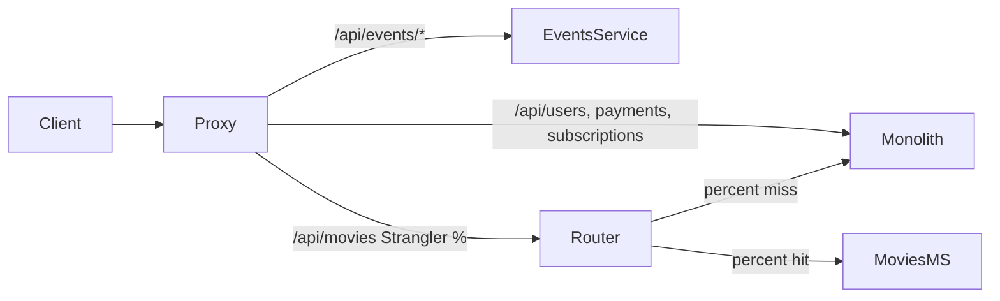
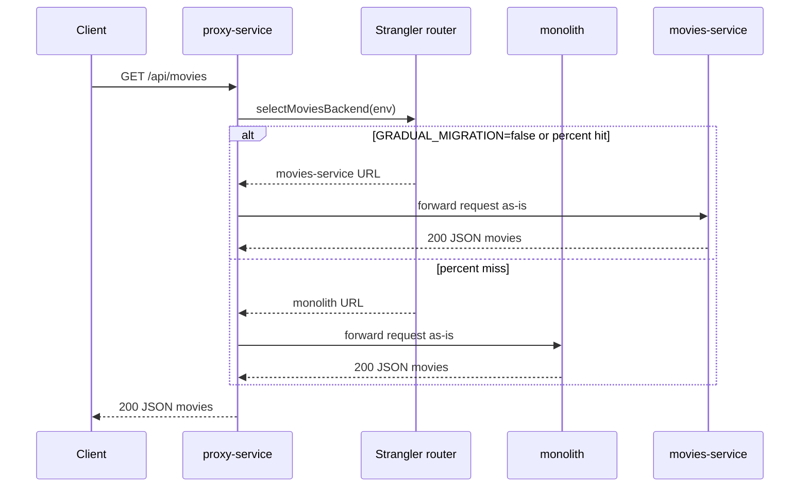

# ADR-004: Strangler Fig proxy — API Gateway, feature toggle, маршрутизация movies

- Status: Accepted
- Date: 2026-09-20
- Deciders: команда разработки CinemaAbyss

## Context

As-Is ([ADR-001](0001-as-is-monolith.md)): один монолит на `:8080`, клиенты ходят напрямую в REST API. To-Be ([`docs/domains-as-is-to-be.md`](../domains-as-is-to-be.md), [`02-container-to-be.puml`](../c4/02-container-to-be.puml)): единая точка входа — **proxy-service** (`:8000`); домен **movies** уже вынесен в **movies-service** (`:8081`).

Нужно зафиксировать:

1. **Как постепенно переключать трафик** `/api/movies` с monolith на movies-service без даунтайма (Strangler Fig).
2. **Как управлять rollout** без деплоя кода (feature toggle через env).
3. **Как маршрутизировать остальные домены** (users, payments, subscriptions, events).
4. **Что не входит в MVP Part 1** — authz JWT ([ADR-003](0003-auth-jwt-monolith-proxy.md)), rate limiting (Demetra #4 из [ADR-002](0002-sync-async-kafka-demetra.md)).

В `docker-compose.yml` уже заданы `GRADUAL_MIGRATION`, `MOVIES_MIGRATION_PERCENT`, URL backend'ов. Код proxy — задание 2, Part 1.

## Decision

### 1. Strangler Fig + API Gateway

**proxy-service** — stateless reverse proxy и единая точка входа для web / mobile / Smart TV. Не дублирует бизнес-логику movies: прозрачно пересылает запросы и ответы в выбранный backend.

Реализация: стандартный **`net/http` + `httputil.ReverseProxy`** с custom `Director` для выбора backend на `/api/movies`. Собственная БД, GORM и хранение состояния миграции **не нужны** — конфигурация только из env.



### 2. Feature toggle: `GRADUAL_MIGRATION` + `MOVIES_MIGRATION_PERCENT`

| Переменная | Значение по умолчанию (compose) | Назначение |
| --- | --- | --- |
| `GRADUAL_MIGRATION` | `"true"` | Включить процентную маршрутизацию movies |
| `MOVIES_MIGRATION_PERCENT` | `"50"` | Доля запросов `/api/movies*` в movies-service (0–100) |
| `MONOLITH_URL` | `http://monolith:8080` | Backend monolith |
| `MOVIES_SERVICE_URL` | `http://movies-service:8081` | Backend movies-service |
| `EVENTS_SERVICE_URL` | `http://events-service:8082` | Backend events-service |
| `PORT` | `8000` | Порт proxy |

**Правила:**

| `GRADUAL_MIGRATION` | `MOVIES_MIGRATION_PERCENT` | Поведение для `/api/movies*` |
| --- | --- | --- |
| `false` | любое | **100%** в movies-service (полный cutover) |
| `true` | `0` | **100%** в monolith |
| `true` | `100` | **100%** в movies-service |
| `true` | `1`…`99` | **~N%** в movies-service, остальное — monolith |

Откат rollout — смена env и перезапуск контейнера, без изменения кода.

### 3. Алгоритм маршрутизации movies: random per request

Для каждого запроса к `/api/movies` и `/api/movies/*`:

```go
func selectMoviesBackend(cfg Config) *url.URL {
    if !cfg.GradualMigration {
        return cfg.MoviesServiceURL // 100% cutover
    }
    if rand.Intn(100) < cfg.MigrationPercent {
        return cfg.MoviesServiceURL
    }
    return cfg.MonolithURL
}
```

**Почему random, а не consistent hash:** KISS; при `percent=50` в среднем ~50% запросов уходит в movies-service. Альтернатива — hash по `X-Request-Id` или `userId` для стабильного backend на одного клиента; сложнее и не требуется тестами Part 1.

Proxy **логирует** выбранный backend (`monolith` / `movies-service`) для ручной проверки при смене `MOVIES_MIGRATION_PERCENT`.

### 4. Таблица маршрутизации

| Path | Backend | Примечание |
| --- | --- | --- |
| `GET /health` | **proxy** (локально) | `text/plain`: `Strangler Fig Proxy is healthy` |
| `/api/movies`, `/api/movies/*` | **Strangler** | monolith **или** movies-service по §2–3 |
| `/api/users`, `/api/users/*` | monolith | |
| `/api/payments`, `/api/payments/*` | monolith | |
| `/api/subscriptions`, `/api/subscriptions/*` | monolith | |
| `/api/events/*` | events-service | Part 1: health; Part 2: POST + Kafka |

Ответы backend'ов **проксируются as-is** — контракт monolith/movies/events не меняется на периметре.

### 5. Собственные ошибки proxy

Только для ошибок самого proxy (502 upstream недоступен, 404 unknown route) — structured `errors[]` (как в warmhouse):

```json
{"errors":[{"type":"BadGatewayError","message":"upstream unavailable"}]}
```

Ответы 4xx/5xx от monolith, movies-service, events-service **не переписываются**.

### 6. Структура сервиса (Part 1)

```
src/microservices/proxy/
├── cmd/api/main.go
├── internal/
│   ├── config/config.go
│   ├── strangler/router.go
│   ├── proxy/handler.go
│   └── api/
│       ├── health.go
│       └── responses/errors.go
├── Dockerfile
└── go.mod
```

Proxy — инфраструктурный сервис без доменной логики; полный clean-arch не нужен. **Swagger на Part 1 не подключаем** — у proxy нет собственных бизнес-эндпоинтов; контракт gateway описан в корневом [`api-specification.yaml`](../../api-specification.yaml).

### 7. Сценарий: `GET /api/movies` через proxy



1. Клиент обращается только к `:8000`.
2. Proxy выбирает backend по env (§2–3), логирует выбор.
3. `ReverseProxy` пересылает method, path, headers, body без изменений.
4. Ответ backend'а возвращается клиенту без трансформации.

### 8. Что рисуем на Container

| Элемент | Что подписать |
| --- | --- |
| **proxy-service** | API Gateway; Strangler Fig (`MOVIES_MIGRATION_PERCENT`); единая точка входа |
| **связь proxy → monolith** | `/api/auth/*`, `/api/users`, `/api/payments`, `/api/subscriptions` |
| **связь proxy → movies** | `/api/movies`, Strangler % |
| **связь proxy → events** | `/api/events/*` |

См. [`02-container-to-be.puml`](../c4/02-container-to-be.puml).

### 9. Вне scope MVP Part 1 (follow-up)

| Возможность | Где зафиксировано | Когда |
| --- | --- | --- |
| **JWT authz** на периметре | [ADR-003](0003-auth-jwt-monolith-proxy.md) | после зелёных Postman Part 1 |
| **Rate limiting** (token bucket, Redis) | [ADR-002](0002-sync-async-kafka-demetra.md) Demetra #4 | после базового gateway |
| **Kubernetes manifests** | `src/kubernetes/proxy-service.yaml` | задание 3 |
| **events-service Phase 2** (Kafka, POST) | [ADR-002](0002-sync-async-kafka-demetra.md) | задание 2, Part 2 |

## Alternatives considered

- **Прямые вызовы monolith/movies без proxy** — клиенты должны знать два URL; невозможен постепенный cutover; нарушает единую точку входа To-Be.
- **Дублирование handlers movies в proxy** — двойная поддержка контракта; при изменении API правки в двух местах; нарушает идею Strangler как прозрачного фасада.
- **Consistent hash по `X-Request-Id` / `userId`** — стабильный backend для одного клиента; сложнее; тесты Part 1 проверяют только процент в логах, не stickiness.
- **Хранение процента миграции в БД / feature-flag сервисе** — stateful proxy; избыточно на MVP; env в compose/k8s ConfigMap достаточно.
- **Blue-green switch одним флагом без процента** — нет постепенного rollout; `MOVIES_MIGRATION_PERCENT` даёт контролируемый переход и A/B в логах.
- **Service mesh (Istio/Linkerd) вместо application proxy** — избыточная инфраструктура для учебного проекта; явный Go-proxy проще отлаживать и сдавать.
- **Auth и rate limit в Part 1 одновременно со Strangler** — раздувает scope; Postman Part 1 auth не проверяет; сначала маршрутизация, затем периметр.

## Consequences

- **Positive:** контролируемый вынос movies без даунтайма; единая точка входа для всех клиентов; откат через env; stateless proxy без БД; прозрачное проксирование сохраняет контракт backend'ов; логи backend-выбора упрощают проверку rollout.
- **Negative:** при `percent` между 0 и 100 один клиент может попасть и в monolith, и в movies-service — данные должны быть согласованы (на MVP общая схема Postgres); random не даёт stickiness; два живых backend'а movies увеличивают операционную сложность до полного cutover.
- **Follow-up:** Part 1 — реализация proxy + events-service Phase 1 (health); Part 2 — events Kafka; затем authz middleware ([ADR-003](0003-auth-jwt-monolith-proxy.md)) и rate limit ([ADR-002](0002-sync-async-kafka-demetra.md)); задание 3 — K8s/Helm для proxy.

## References

- [`docs/c4/02-container-to-be.puml`](../c4/02-container-to-be.puml) — Container To-Be, proxy как Gateway
- [`docs/domains-as-is-to-be.md`](../domains-as-is-to-be.md) — единая точка входа, Strangler
- [`api-specification.yaml`](../../api-specification.yaml) — контракт gateway, `/health`
- [`docker-compose.yml`](../../docker-compose.yml) — env proxy-service
- [ADR-002](0002-sync-async-kafka-demetra.md) — sync-маршруты через proxy, rate limit follow-up
- [ADR-003](0003-auth-jwt-monolith-proxy.md) — authz на proxy (follow-up)
- [Martin Fowler — Strangler Fig Application](https://martinfowler.com/bliki/StranglerFigApplication.html)
